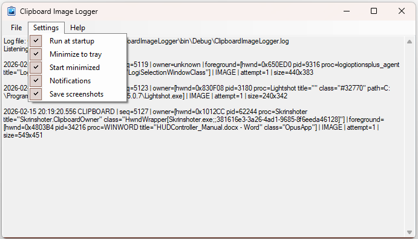

# Clipboard Image Logger

**Download**: [ClipboardImageLogger.zip](https://github.com/alexz006/Clipboard-Image-Logger/releases/download/ClipboardImageLogger/ClipboardImageLogger.zip)

## EN

A little tool for paranoids who worry that someone (or something) is taking screenshots without your knowledge.  
If you’ve ever thought “wait… who just put an image into my clipboard?” — this is for you  🕵️‍♂️😅

**Clipboard Image Logger** is a small Windows app that watches clipboard changes and reacts **only to images** (screenshots and any copied pictures).

- logs an entry when an image appears in the clipboard
- tries to capture context: **window/process** (owner/foreground)
- optional lightweight notifications
- optional auto-save to the app folder as:  
  `image_<proc>_date_time.png`

### Settings
In **Settings** you can toggle:
- run at startup
- minimize to tray / start minimized
- notifications
- screenshot saving

### Who it’s for
Anyone who wants a quick, no-drama answer to: *“An image appeared in my clipboard — when, and roughly from where?”*

---

## RU

Программа для параноиков, которые переживают, что кто-то (или что-то) делает скриншоты без вашего ведома.
Если вы тоже иногда ловите себя на мысли “а кто это только что положил картинку в буфер?” — вам сюда 🕵️‍♂️😅

**Clipboard Image Logger** — небольшая Windows-программа, которая отслеживает изменения буфера обмена и реагирует **только на изображения** (скриншоты и любые картинки, попавшие в clipboard).

- пишет запись в лог, когда в буфере появляется изображение
- пытается определить контекст: **окно/процесс** (owner/foreground)
- по желанию показывает небольшое уведомление
- опционально сохраняет изображение рядом с программой в файл вида:  
  `image_<proc>_date_time.png`

### Настройки
В меню **Settings** можно включить:
- автозапуск
- сворачивание в трей / старт свернутым
- уведомления
- сохранение скриншотов

### Для кого
Для тех, кто хочет **быстро** видеть факты: *“в буфере появилась картинка — когда и примерно откуда”*.
